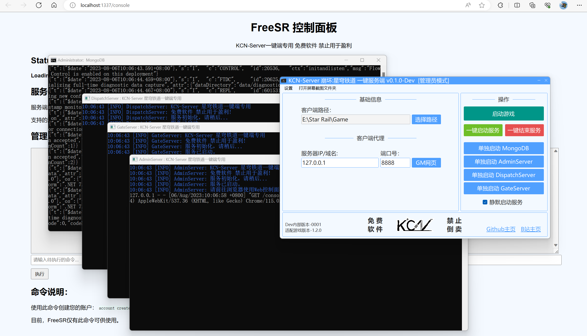

# KCN-StarRailServer

> 适用于 崩坏:星穹铁道 的一键GUI多功能服务端。

### 关于软件
- 软件还不完善，就多谢大家debug&提issues了！将来可能会写一些方便的新功能，敬请期待喵~ 
- 教程和疑难解答都在页面下方，请认真阅读后再开始搭建！
- 当前支持的游戏版本：1.2.0

### 软件下载
- 请到最新[Releases](https://github.com/JDDKCN/KCN-StarRailServer/releases/)处下载。

### 软件截图
- v0.1.0-Dev 2023/08/26

### 更新日志
- v0.1.1-Dev 2023/08/26
  1. 对于服务闪退问题进行了优化。
  2. 完善了程序，修改了用户反馈的bug。
  
- v0.1.0-Dev 2023/08/26
  1. 初始发布程序。

### 系统支持

| 系统           | 可用性    | 系统         | 可用性    |
|---------------|----------|--------------|----------|
| Windows 11    | 支持     | Windows XP   | 不支持    |
| Windows 10    | 支持     | Mac OS       | 不支持    |
| Windows 7 - 8 | 不支持   | Linux        | 不支持    |

### 程序使用说明

- **首次启动**
  1. 点击 `KCN-StarRailServer.exe` ，启动程序。
  2. 在 `客户端路径` 中选择游戏主程序所在的路径。
  3. 点击 `一键启动服务` 按钮，这将会启动服务端及数据库进程。
  4. 点击 `GM网页` 按钮，您的浏览器中应该会出现一个标题为 `FreeSR 控制面板` 的网页。
  5. 在此网页的管理员控制台中创建您的账户，命令语法为：`account create [登录用户名] [密码]`。
  6. 点击 `开始游戏` 按钮，如果弹出安装CA证书提示，请点击确定。
  7. 在游戏登陆页面中输入您刚才创建账户的名称及密码。开始游戏吧。

### 疑难解答&问题说明
> 以下问题是网友普遍反馈的问题&想要了解的事项，基本涵盖了大部分用户可能会遇到的问题。该条目会随时补充，欢迎私信或提issues。

  - 无法打开GM网页/服务闪退
    1. 可能是您电脑上的.NET版本过低。请点击 `安装.NET运行时` 按钮，安装新版.NET后问题即可解决。

### 免责声明
- 本程序是基于Github开源项目[FreeSR](https://github.com/xeonnnnn/FreeSR)制作的 崩坏:星穹铁道 一键GUI多功能服务端，仅供研究交流用，禁止用于商业及非法用途。使用本软件造成的事故与损失，与作者无关。本程序完全免费，如果您是花钱买的，说明您被骗了。请尽快退款，以减少您的损失。

### 联系方式
- [前往我的B站首页](https://space.bilibili.com/475547854/)
- [前往我的Twitter账号](https://twitter.com/2233KCN)